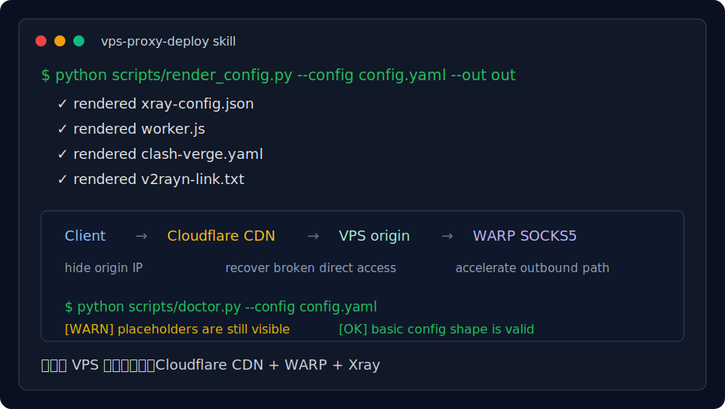

# vps-proxy-deploy

> 一个让 AI 帮你复活和加速低价 VPS 的 Codex Skill。  
> 把 `vps-proxy-deploy/` 丢给支持 Skills 的 AI，它会引导你用 Cloudflare CDN + WARP + Xray 把直连不稳定的 VPS 改造成自托管网络网关。

[](https://github.com/cheak1988/vps-proxy-deploy/actions/workflows/ci.yml)
[](LICENSE)



## 为什么做成 Skill

这套方案不是一个单命令能解决的问题。用户经常卡在：

- VPS IP 直连被干扰，但机器本身还活着。
- SSH 抽风，只能用 VPS 服务商 VNC 救援。
- Cloudflare 橙云、525、回源端口、SSL 模式容易配错。
- WARP full tunnel 会把入口搞坏，必须用 proxy mode。
- Clash Verge / V2RayN 的 UUID、path、Host、SNI 任意一个错就失败。

所以更适合让 AI 按 skill 的流程来问、判断、生成配置、排查问题。脚本只是 skill 的可靠工具，不是主产品。

## 核心思路

```text
Client -> Cloudflare CDN -> VPS Xray VLESS+WS -> WARP SOCKS5 -> Internet
```

这不是“解封 VPS IP”。它是把用户入口从直连 VPS 改成 Cloudflare CDN 回源。只要 VPS 还活着、Cloudflare 还能回源，原本直连废掉的服务就有机会复活。

## 安装方式

复制这个文件夹到你的 Codex skills 目录：

```bash
vps-proxy-deploy/
  SKILL.md
  agents/openai.yaml
  scripts/
  references/
  assets/
```

例如：

```bash
git clone https://github.com/cheak1988/vps-proxy-deploy.git
mkdir -p ~/.codex/skills
cp -R vps-proxy-deploy/vps-proxy-deploy ~/.codex/skills/
```

Windows PowerShell 示例：

```powershell
git clone https://github.com/cheak1988/vps-proxy-deploy.git
New-Item -ItemType Directory -Force "$env:USERPROFILE\.codex\skills"
Copy-Item -Recurse .\vps-proxy-deploy\vps-proxy-deploy "$env:USERPROFILE\.codex\skills\"
```

之后你可以直接对 AI 说：

```text
用 vps-proxy-deploy skill，帮我把一台低价 VPS 用 Cloudflare CDN + WARP 复活并生成 Clash 配置。
```

## Skill 能做什么

- 解释被封/直连不稳 VPS 如何通过 Cloudflare CDN 回源恢复服务。
- 引导收集必要参数，不要求用户公开密码或 token。
- 生成 Xray、Cloudflare Worker、Clash Verge、V2RayN 配置。
- 指导 VPS 端安装 Xray VLESS+WS 和 WARP proxy mode。
- 诊断 Cloudflare 525、alive=false、DNS、WebSocket、WARP full tunnel 等常见坑。
- 帮用户在分享日志前脱敏 IP、UUID、token、password。

## 直接使用脚本

如果不通过 AI，也可以手动调用 skill 里的脚本：

```bash
python vps-proxy-deploy/scripts/render_config.py --init config.yaml
python vps-proxy-deploy/scripts/render_config.py --config config.yaml --out out
python vps-proxy-deploy/scripts/doctor.py --config config.yaml
python vps-proxy-deploy/scripts/redact.py your-log.txt --check
```

VPS 端脚本默认 dry run，必须显式传 `RUN=1` 才会修改系统：

```bash
VLESS_UUID=VLESS_UUID_HERE WS_PATH=/ws RUN=1 bash vps-proxy-deploy/scripts/install-xray-ws.sh
RUN=1 bash vps-proxy-deploy/scripts/install-warp-proxy.sh
```

## 仓库结构

```text
vps-proxy-deploy/
  SKILL.md              # 核心 skill 指令
  agents/openai.yaml    # UI 元数据
  scripts/              # 配置生成、诊断、脱敏、VPS 安装脚本
  references/           # 架构、排错、安全、benchmark、客户端配置
  assets/               # README/传播用资源
```

## 传播文案

见 [vps-proxy-deploy/references/social-posts.md](vps-proxy-deploy/references/social-posts.md)。

一句话版本：

```text
我做了一个 AI Skill：把低价 VPS 信息丢给 AI，它会引导你用 Cloudflare CDN + WARP + Xray 把直连废掉的 VPS 救回来。
```

## 边界

- 不保证所有 VPS 都能复活。
- 不保证固定速度或永久可用。
- 不自动索要或保存 Cloudflare token。
- 不应该把真实 IP、UUID、root 密码、token 发到公开 issue。

## License

MIT
